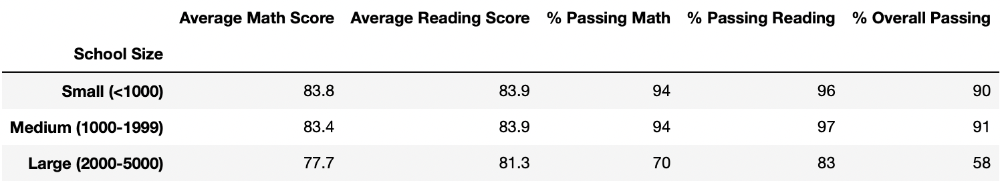

# **IMPACT OF THE 9TH GRADERS OF THOMAS HIGH SCHOOL IN THE SCHOOL DISTRICT ANALYSIS**

## ***OVERVIEW***

### The purpose of this analysis is to provide Maria and her supervisor of a clear view of the impact that the potential disnhonesty of the Thomas High School 9th graders cause in the School District analysis after replacing their math and reading scores by NaN.

## ***RESULTS***

### **1. District Summary Impact**

#### We can see that the % Passing Math, % Passing Reading and % Overall Passing had a slight decrease by passing from 75, 86 and 65 respectively to 74.8, 85.7 and 64.9 respectively, as can be seen in the following images:

### **2. School Summary Affectation**

#### In this case, we can see that only the summary for the Thomas high School metrics changed as follows:
#### Before

#### After

### **3. Thomas High School Performance Affectation**

#### As we can see in the above images, the Thomas High School performance is severely affected by replacing the 9th graders, the % Passing Math, % Passing Reading and % Overall Passing drops from 93.27, 97.30 and 90.94 respectively, to 66.91, 69.66 and 65.07 respectively, making it drop from the top performing schools to the worst ones of the district.

### **4. Math and Reading Scores Affectation**

#### The only afectation is in the Thomas High School 9th grade series, where there is the NaN value as we can see below:
 

### **5. Scores by School Spending Affectation**

#### There is a very slight change in the range $631-645, where the Thomas High School is located, but when rounding to 1 decimal, we can no longer see the difference.

### **6. Scores by School Size Affectation**

#### Same as with the spending, the Medium Size change is very littel and gets unnoticed once the figures are formatted to 1 digit.

### **7. Scores by School Type Affectation**

#### We see that in the charter type there is also a slight change but again, when looking at the formatted data, we cannot see any difference.

## ***SUMMARY***

### Finally, we can list only 4 visible changes in the data after replacing the 9th graders from Thomas High School:
### 1. A slight impact in the district summary.
### 2. The school summary affectation only for the Thomas High School row.
### 3. An important impact in the Thomas High School performance if we do not replace the NaN figures with the 10th-12th data.
### 4. The 9th series with the NaN data for the Thomas Hight School case.

### It is important to notice that, by replacing the affected scores when we replaced the 9th grades for Thomas High School with NaN we severely affected Thomas Highscholl perfomarce, so by replacing the scores with the 10th - 12th grades this problem was practically solved.

